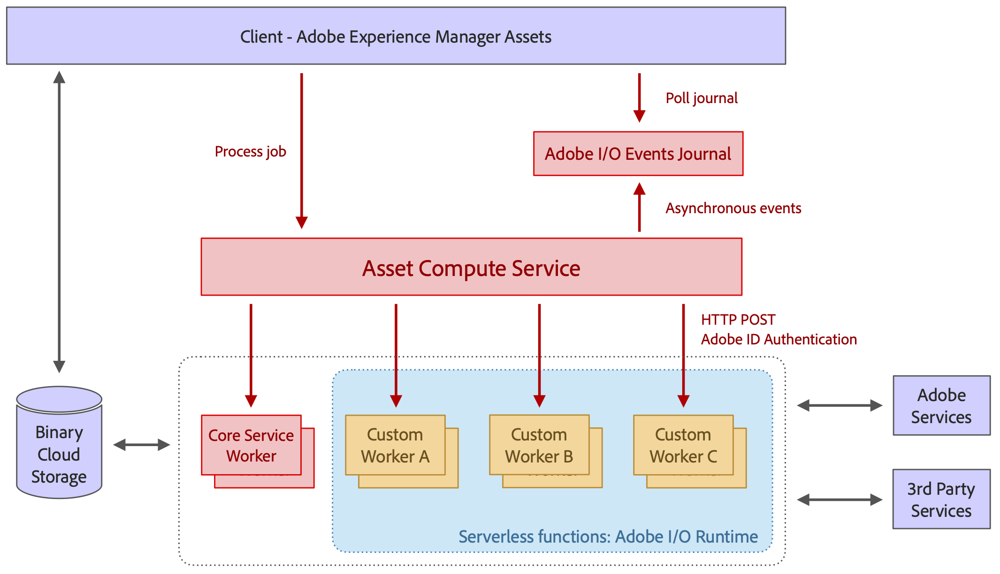

# [!DNL Asset Compute Service]的体系结构 {#overview}

[!DNL Asset Compute Service]构建在无服务器Adobe[!DNL `I/O Runtime`]平台上。 它为资源提供Adobe Sensei内容服务支持。 向调用客户端（仅支持[!DNL Experience Manager]作为[!DNL Cloud Service]）提供其为该资源查找的Adobe Sensei生成的信息。 返回的信息采用JSON格式。

通过创建基于[!DNL Adobe Developer App Builder]的自定义应用程序，[!DNL Asset Compute Service]是可扩展的。 这些自定义应用程序是[!DNL Project Adobe Developer App Builder]个无头应用程序，可执行添加自定义转换工具或调用外部API以执行图像操作等任务。

[!DNL Project Adobe Developer App Builder]是一个在Adobe[!DNL `I/O Runtime`]上生成和部署自定义Web应用程序的框架。 若要创建自定义应用程序，开发人员可以利用[!DNL React Spectrum]&#x200B;(Adobe的UI工具包)、创建微服务、创建自定义事件和协调API。 请参阅[Adobe Developer App Builder文档](https://developer.adobe.com/app-builder/docs/intro_and_overview/#)。

该体系结构所基于的基础包括：

* 仅包含特定任务所需内容的应用程序的模块性允许将应用程序彼此分离，并使它们保持轻量级。

* 无服务器[!DNL Adobe I/O]运行时概念带来了诸多好处：异步、高度可扩展、隔离、基于作业的处理，非常适合资源处理。

* 二进制云存储使用预签名的URL引用，为单独存储和访问资源文件和格式副本提供了必要的功能，而无需对存储具有完全访问权限。 传输加速、CDN缓存和将计算应用程序与云存储共同定位，可实现最佳的低延迟内容访问。 支持AWS和Azure云。

*图： [!DNL Asset Compute Service]的体系结构及其如何与[!DNL Experience Manager]、存储和处理应用程序集成。*

该体系结构由以下部分组成：

* **API和业务协调层**&#x200B;接收请求（JSON格式），这些请求指示服务将源资源转换为多个演绎版。 这些请求是异步的，并且返回一个激活ID即作业ID。 指令是纯声明性的，对于所有标准处理工作（例如，缩略图生成、文本提取），使用者仅指定所需的结果，而不会指定处理某些格式副本的应用程序。 通用API功能（如身份验证、分析、速率限制）在服务前使用Adobe API网关处理，并管理所有到[!DNL Adobe I/O]运行时的请求。 应用程序路由由协调层动态完成。 客户端为特定呈现版本定义自定义应用程序，这些应用程序带有自己的一组唯一参数。 应用程序执行可以完全并行，因为它们是Adobe [!DNL `I/O Runtime`]中的单独无服务器函数。

* **用于处理专门处理特定类型文件格式或目标呈现的资源的应用程序**。 从概念上讲，应用程序类似于UNIX®管道概念：输入文件被转换为一个或多个输出文件。

* **一个[公共应用程序库](https://github.com/adobe/asset-compute-sdk)**&#x200B;处理公共任务。 例如，下载源文件、上传演绎版、错误报告、事件发送和监控。 此设计确保应用程序开发保持简单明了，遵循无服务器概念，交互仅限于本地文件系统。

<!-- 
TBD:

* About the YAML file?
* minimize description to custom applications
* remove all internal stuff (e.g. Photoshop application, API Gateway) from text and diagram
* update diagram to focus on 3rd party custom applications ONLY
* Explain important transactions/handshakes?
* Flow of assets/control? See the illustration on the Nui diagrams wiki.
* Illustrations. See the SVG shared by Alex.
* Exceptions? Limitations? Call-outs? Gotchas?
* Do we want to add what basic processing is not available currently, that is expected by existing AEM customers?
-->
